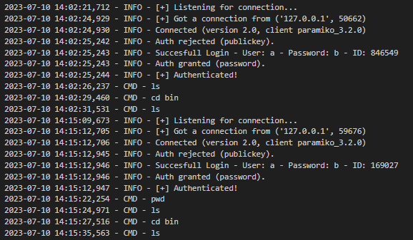

# OWN_HONEYPOT
Creación de un Honeypot desde 0 basado en conexiones SSH.

**Implementando una base de datos de conjuntos de contraseñas y usuarios: Server_Files/INFO_SERVER/etc/userdb.txt**

**Un log con el registro de las entradas que se han hecho al servidor con con comandos ejecutados por sesión: Server_Files/server_log.txt**
